<!-- Header Banner -->

  

<!-- Bio & About Me -->

  <h3>👋 Hello there!</h3>

  - 🎓 **Student** at UNMSM (Universidad Nacional Mayor de San Marcos)
  - 📚 **Currently Learning:** Data Science & Analytics, while also honing my web development skills
  - 🤖 **Developer Style:** Building web applications and data projects
  - ☁️ **Tech Interests:** Cloud Computing, Data Science, and AI technologies

 

<!-- Hobbies -->

  <h3>📅 Hobbies</h3>

  - 🎸 Listening to music & playing musical instruments
  - 🍿 Watching TV shows & anime
  - 🎮 Playing video games
  - 🤖 Exploring AI developments & LLMs

 

---

<!-- GitHub Trophies -->

  

 

<!-- GitHub Stats Grid -->

  <table>
    <tr>
      <td align="center" width="50%" valign="top">
        
      </td>
      <td align="center" width="50%" valign="top">
        
      </td>
    </tr>
    <tr>
      <td align="center" colspan="2" valign="top">
        
      </td>
    </tr>
  </table>

---

## 🛠️ Technologies & Tools

<!-- Programming Languages -->
<h3 align="center">💻 Programming Languages</h3>

  &nbsp;
  &nbsp;
  &nbsp;
  

<!-- Frontend -->
<h3 align="center">🎨 Frontend</h3>

  &nbsp;
  &nbsp;
  &nbsp;
  &nbsp;
  

<!-- Backend & APIs -->
<h3 align="center">⚙️ Backend & APIs</h3>

  &nbsp;
  &nbsp;
  &nbsp;
  &nbsp;
  

<!-- Databases -->
<h3 align="center">🗄️ Databases</h3>

  &nbsp;
  &nbsp;
  

<!-- Data Science & AI -->
<h3 align="center">🧠 Data Science & AI</h3>

  

<!-- Cloud & DevOps -->
<h3 align="center">☁️ Cloud & DevOps</h3>

  &nbsp;
  &nbsp;
  &nbsp;
  &nbsp;
  &nbsp;
  &nbsp;
  

<!-- Mobile -->
<h3 align="center">📱 Mobile</h3>

  &nbsp;
  &nbsp;
  

<!-- IDEs & Editors -->
<h3 align="center">🧩 IDEs & Editors</h3>

  &nbsp;
  &nbsp;
  &nbsp;
  

---

<!-- Spotify Music Dashboard -->

  <h2>🎧 My Music</h2>

  <!-- SPOTIFY_START -->
  
   
  
<!-- SPOTIFY_END -->

 

---

<!-- Contact & Links -->

  <h3>Let's Connect! 📬</h3>
  
  

